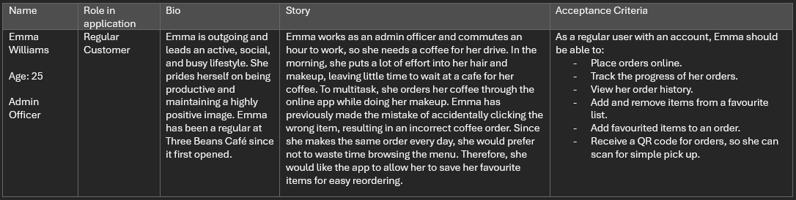

# Esther Faith Dennis, Brett Russell and Nicholas Rowe T3A2 - Part A

# R1 Description of your website, including:

## Purpose

### The Problem

Three Beans is a small suburban cafe specialising in takeaway coffee. The owner approached us to create a web application for their staff and customers in order to assist them in improving their efficiency of service.

With their recent growth and increased business, Three Beans has encountered longer lines and increased wait times, which, while a sign of success, has also led to some customer dissatisfaction.

### The Solution

To address the issue of longer wait times and crowded stores during peak hours, we have suggested an appllication that will allow customers to place orders in advance and track the status and wait time of their orders.  
This allows users to plan their commute and arrive at the cafe as their coffee order is being completed, which will minimise unnecessary in-store waiting.  
Additionally, this application will offer extra convenience to regular customers by allowing them to save their favourite orders, thus eliminating the need for manual customisation with each use.  
This system aims to reduce peak-time crowding, enhance customer convenience, and improve overall productivity and satisfaction.

## Functionality / features

#### The Three Beans Cafe website is accessible to the public, offering the following features:

- A navbar for easily accessing different pages.
- A menu page with images and descriptions of each item sold.
- A login/signup portal for users to create profiles for placing orders.
- The ability to customise and add items to a cart for purchase.
- The ability to place orders through a checkout feature.
- Confirmation of orders through QR codes.
- Order status tracking in app where users can track wait time.

#### Users who create a profile will have these additional features:

- An option to add selected items to a favourite List.
- The ability to customise and remove items within that list.

#### Admin users (staff) will also have a portal within the application which will allow them to:

- View ongoing and previous orders .
- Update the completion status of orders.
- Add new items to the existing menu.
- Make adjustments to existing menu items.
- Delete menu items that are no longer available.
- Track and modify inventory supplies.

## Target audience

#### The target audience will be the following groups:

- Regular customers who want to conveniently save and place orders.
- People looking for information about food and coffee options in the area.
- Commuters seeking a time-saving way to order coffee on their way to work.
- Cafe staff who can use the tracking and order history to improve efficiency.
- Management wanting to track sales and update menu options.

### Tech stack

#### Front end

- [JavaScript](https://www.javascript.com/)
- [ReactJS](https://react.dev/)
- [HTML5](https://developer.mozilla.org/en-US/docs/Glossary/HTML5)
- [CSS](https://developer.mozilla.org/en-US/docs/Web/CSS)

#### Database

- [MongoDB](https://www.mongodb.com/)

#### Object Document Mapping

- [Mongoose](https://mongoosejs.com/docs/)

#### Back end

- [Node.JS](https://nodejs.org/en)
- [ExpressJS](https://expressjs.com/)

#### Testing

- [Jest](https://jestjs.io/)

#### Package Management

- [npm](https://www.npmjs.com/)

#### Diagrams

- [draw.io](https://www.drawio.com/)

#### Design

- [Figma](https://www.figma.com/)

#### Project Management

- [Trello](https://trello.com/home)

#### DevOps

- [Visual Studio Code](https://code.visualstudio.com/)
- [GitHub](https://github.com/)

#### Hosting

- [Netlify](https://www.netlify.com/) (front end)
- [Render](https://render.com/) (back end)
- [MongoDB atlas](https://www.mongodb.com/products/platform/atlas-database) (database)

# R2 Dataflow Diagram

### Overview Diagram

We first created a process decomposition of the application using the Gene & Sarson method of notation. This shows a broad overview of our apps system processes:

### Sequence Diagrams

We also created four sequence diagrams to show a more comprehensive representation of how various pieces of data move throughout our application.

This diagram shows user login/signup:

This diagram shows the process of placing an order:

This diagram shows an admin user updating the status of an ongoing order:

This diagram shows and admin user adding a new item to the menu:

# R3 Application Architecture Diagram

# R4 User Stories

# R4 User Stories

### Standard User

1. As a user, I want to be able to view the home page and navigate to the menu page.
2. As a user, I want to be able to view information about the menu items.
3. As a user, I want to be able to add menu items to a cart.
4. As a user, I want to be able to modify items in the cart.
5. As a user, I want to be able to checkout.
6. As a user, I want to be able to receive an order confirmation and a QR code which I can use to collect my order.
7. As a user, I want to be able to check my order's status.
8. As a user, I want to be able to sign up and create an account.
9. As a user, I want to be able to log in and log out of my account.

### Signed In User

1. As a user, I want to be able to save menu items to a favourite page.
2. As a user, I want to be able to delete menu items on my favourite page.
3. As a user, I want to be able to select items from my favourite list and add them to the cart.
4. As a user, I want to be able to view my order history.

### Cafe Order Management System

1. As a staff mamber using the system, I want to be able to see a list of current orders.
2. As a staff mamber using the system, I want to be able to view an individual order.
3. As a staff mamber using the system, I want to be able to change the status of an order.
4. As a staff mamber using the system, I want to be able to scan a customer's QR code.
5. As a staff mamber using the system, I want to be able to view the availability of menu items.
6. As a staff mamber using the system, I want to be able to change the availability of menu items.

### Admin

1. As an admin using the system, I want to be able to create menu items.
2. As an admin using the system, I want to be able to update and delete menu items.
3. As an admin using the system, I want to be able to check the sales figures.

## User Personas

### User - John Graham - First time Customer

### User - Emma Williams - Regular Customer

### Staff mamber - Misha Harrington

### Manager - Patrick LeBreton

## Refined User Stores

### Standard User

1. As a user, I want to be able to view the home page and navigate to the menu page, so that I can see that I can start building my order.
2. As a user, I want to be able to view information about the menu items, so I can make a decision about what to order.
3. As a user, I want to be able to add menu items directly to a cart, so that I can keep browsing and adding more items to my order
4. As a user, I want to be able to modify items in the cart, so that if I change my mind and don't have to cancel the whole order.
5. As a user, I want to be able to checkout, so that I can finish and pay for my order.
6. As a user, I want to be able to receive an order confirmation and a QR code so that I can use it to collect my order quickly and easily.
7. As a user, I want to be able to check my order's status, so that I can know how long the wait time will be before I can pick up my order.
8. As a user, I want to be able to sign up and create an account, so that I can personalise and improve my user experience.
9. As a user, I want to be able to log in and log out of my account, so that I can access my account when I need it but don't become a security risk if I need to log out.

### Signed In User

1. As a user, I want to be able to save menu items to a favourite page, so that I can quickly find and order my favourite menu items.
2. As a user, I want to be able to delete menu items on my favourite page, so that if I don't want the item anymore it doesn't take up space on my favourite page.
3. As a user, I want to be able to select items from my favourite list and add them to the cart, so that I can quickly build an order for things I know I like.
4. As a user, I want to be able to view my order history, so that if I don't remember what I ordered last time, I can still look back in the history and find it again.

### Cafe Order Management System

1. As a staff member using the system, I want to be able to see a list of current orders, so that I know which order to make next.
2. As a staff member using the system, I want to be able to view an individual order, so that I can see what menu items to prepare.
3. As a staff member using the system, I want to be able to change the status of an order, so that I can inform the customer of the progress.
4. As a staff member using the system, I want to be able to scan a customer's QR code, so that can identify the customer order quickly.
5. As a staff member using the system, I want to be able to view the availability of menu items, so that I know how many are left to sell.
6. As a staff member using the system, I want to be able to change the availability of menu items, so that I can override availability if an item unexpectedly becomes unavailable.

### Admin

1. As an admin using the system, I want to be able to create menu items, so that it can displayed to users who can order it.
2. As an admin using the system, I want to be able to update and delete menu items, so that I can change the menu over time.
3. As an admin using the system, I want to be able to check the sales figures, so that I know how much money and how many item has been sold today.

### John

1. I want to make an online order where I can see the menu items with photos and descriptions, so that I know what the items look like and what are the ingredients.
2. I want to easily add items to the cart, so that I can quickly keep browsing the menu while I am building my order.
3. I want to modify the cart, so that if I added too many items or the wrong items, I can fix my order without restarting.
4. I want to receive a confirmation with a QR code, so that I know how to collect my order and avoid people having someone else with the same name picking up my order.
5. I want to able to check the order status so that I know how long until I can collect my order and don't arrive too soon.

### Emma

1. I want to easily make an online order when I am in a rush.
2. I want to save my favourite items, so that I can quickly order my favourite items.
3. I want to add my favourite items to the cart directly, so that I can save time by not going through the menu again to find the item.
4. I want to received the QR code of the order, so that the staff can quickly identify my order.

### Misha

1. I want to view all the orders, so that I know how many orders I need to prepare and which one I should make next.
2. I want to change the order status after I made it, so that the user knows how their order is going.
3. I want to change menu item availablity, so that the user won't order something which is not available.
4. I want to scan customer's QR code, so that I know which order to give them.

### Patrick

1. I want to add some new items to the menu, so that customer's can start ordering it.
2. I want to delete some old menu items, so that customers can no longer order an item that does't exist anymore.
3. I want to change the existing menu item, so that customers know that the item has changed and are not surprised when they receive the order.
4. I want to view the sales at the end of the day, so that I know how much money I made and how many items I have sold.

# R5 Wireframes for multiple standard screen sizes, created using industry standard software

#### Home Page - Logout out

#### Login page

#### Register Page

#### Home Page Logged in

#### Menu

#### Menu cart

#### Extended menu

#### Cart

#### Order Confirmation

#### User Order History

#### User Favourite List

#### Admin current orders

#### Edit and add items

#### Add items

#### Edit items

### Iphone

#### Home - logged out

#### Log in

#### Register

#### logged in

#### Menu

#### Menu Extended

#### Cart

#### Order Confirmation

#### User Order History

#### User Favourites

#### Admin Current Orders

#### Admin edit/add Menu

#### Admin edit

#### Admin add

# R6 Trello

For the project, we will use the below platforms to do our project management and planning:

- Trello - We will use Trello to plan the project. There are four sprints as shown below:

  - Documentation: Documentation tickets start out in the "To do" column. This is for part A of the assignment. We divide the questions into tickets on the board and each team member can pick up a ticket and drag it to the "Doing" section.
  - Frontend: Frontend also starts with tickets for each part of the Frontend work in the "To do" column. Each ticket will have a name and description describing what needs to be done for that ticket. This sprint will be done after the documentation part is done, then the team members who will develop the Frontend can pick up a ticket and drag it to the "Doing" section.
  - Backend: Backend also starts with tickets for each part of the work in the "To do" column. Each ticket also has a name and description describing what needs to be done as part of that ticket. After the Documentation sprint is done, then the team members who will develop the Backend can pick up a ticket and drag it to the "Doing" section.
  - Deployments: The deployment sprint is for near the end of the development when we want to start making our app available online. This will include deployment of both Frontend and Backend.

  Progress during a sprint:

  - Backlog: If any ticket is blocked and not able to progress because of another ticket, we will drag it to the Backlog section, then the team will review what needs to be done, and help to unblock that ticket as soon as possible.
  - Todo: During a sprint each team member when they finish their current ticket can pick up a new ticket out of the correct Todo section.
  - Doing: Tickets in the Doing column are used to track the work which which is currently in progress.
  - Code Review: When we finish one ticket, we will open a pull request and allow other team members to review it.
  - Test: After we have done a feature/ticket, we will drag it to the "Test" column, then other team members will have a chance to test it is working properly.

- Discord - We have created a team channel for the project using Discord. We can share our ideas in the Discord, and organise meetings and stand ups in the chat. For meetings we will use Zoom.

Below are some screenshots for Trello project.

